# Atividade RA3

Alunos: Guilherme Tuchanski Rocha e Luiz Henrique Matoso
Repositório do Código: https://github.com/tuchanski/hashing-ra3

## 1. Introdução

A Tabela Hash é uma estrutura de dados projetada para oferecer um tempo de busca médio constante, independente do número de elementos que estão armazenados. Uma função mal projetada pode concentrar todos os dados em poucos pontos, gerando colisões que anulam a eficiência do sistema. Além disso, uma tabela pequena demais para o volume de dados a ser armazenados resultará em um desempenho medíocre.

Este trabalho se propõe a investigar na prática como essas escolhas de projeto afetam o desempenho de uma Tabela Hash. Por meio da proposta sugerida pelo professor, realizamos uma análise comparativa de três funções Hash (Resto da Divisão, Multiplicação e Dobramento) sob diferentes fatores de carga, variando o tamanho da tabela e o volume de dados. O estudo mede o tempo de inserção, a quantidade de colisões e as comparações de busca para fornecer uma visão clara dos prós e contras de cada configuração.

## 2. Metodologia

### 2.1 Ambiente

O experimento foi conduzido utilizando Java. As medições de tempo foram realizadas através das funções System.currentTimeMillis() para operações de longa duração (inserção em massa) e System.nanoTime() para operações de curta duração (buscas individuais).

### 2.2 Estrutura de Dados

Foi implementada uma estrutura de Tabela Hash com tratamento de colisão por encadeamento. A estrutura consiste em um vetor de base, onde cada posição aponta para uma lista encadeada que armazena os registros cujo código resulta naquele mesmo índice. Os elementos armazenados são objetos da classe Registro, que encapsulam um código inteiro de 9 dígitos.

### 2.3 Funções de Hash

Para avaliar o impacto da função de espalhamento no desempenho, escolhemos três funções de hash distintas:

#### 2.3.1 Resto da Divisão

Calcula o resto da divisão do código do registro pelo tamanho da tabela.

Foi escolhida como uma base de referência. É a função mais simples e rápida de se calcular. Escolhemos para comparar o seu desempenho com a de funções mais elaboradas.

#### 2.3.2 Multiplicação

Multiplica o código por uma constante A (0 < A < 1), extrai a parte fracionária do resultado e multiplica pelo tamanho da tabela para obter o índice.

Foi escolhida para representar uma abordagem aritmética.

#### 2.3.3 Dobramento

O código de 9 dígitos foi tratado como uma string, divido em três partes de três dígitos cada. As partes foram somadas e o resto da divisão dessa soma pelo tamanho da tabela foi usado como índice.

Foi escolhida para testar uma abordagem não puramente aritmética. É interessante para avaliar como essa técnica lida tanto em qualidade de distribuição quanto em custo computacional, pois há operações de string/conversão.

### 2.4 Geração dos Dados

Foram gerados três conjuntos de dados com 1 milhão, 5 milhões e 20 milhões de registros. Todos foram gerados utilizando uma seed fixa, o que assegura que os mesmos conjuntos de dados foram utilizados nos 27 cenários de teste.

## 3. Resultados

### 3.1 Desempenho de Inserção

O primeiro indicador de desempenho avaliado foi o custo computacional de cada função de hash.

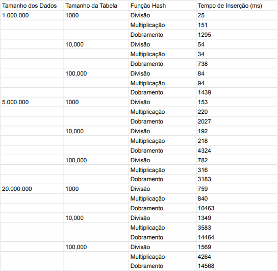
_Tabela de Custo de Inserção_

##

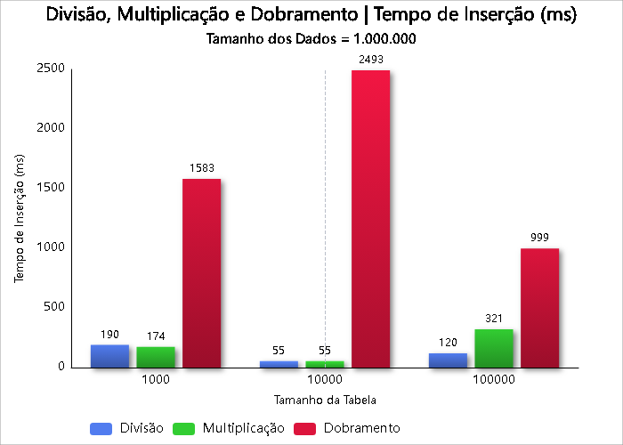
_Gráfico do Tempo de Inserção em milissegundo (ms) para Divisão, Multiplicação e Dobramento com Tamanho dos Dados de 1.000.000._

##

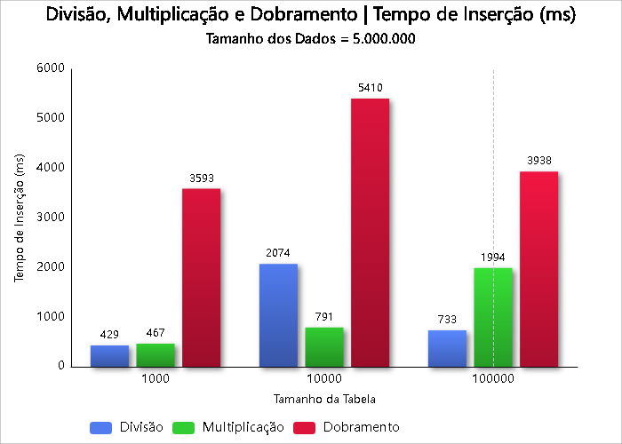
_Gráfico do Tempo de Inserção em milissegundo (ms) para Divisão, Multiplicação e Dobramento com Tamanho dos Dados de 5.000.000._

##

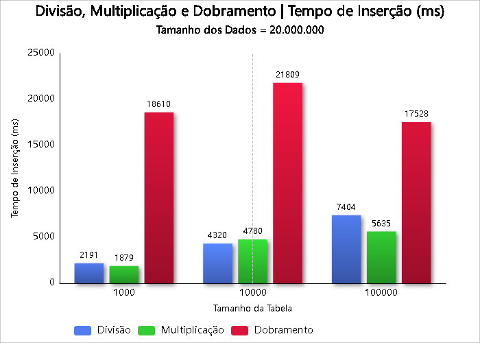
_Gráfico do Tempo de Inserção em milissegundo (ms) para Divisão, Multiplicação e Dobramento com Tamanho dos Dados de 20.000.000._

##

Os três gráficos apresentados comparam o tempo de inserção (em milissegundos) utilizando as funções de hash Divisão, Multiplicação e Dobramento, para diferentes quantidades de dados: 1.000.000, 5.000.000 e 20.000.000.

Cada gráfico apresenta três barras para cada função hash, variando de acordo com o tamanho da tabela (1000, 10000 e 100000). Essa análise permite observar como a performance de inserção é impactada conforme aumentamos o número de dados e o tamanho da tabela.

Principais observações:

- A função de hash por Dobramento apresenta os maiores tempos de inserção na maioria dos casos, especialmente com tabelas pequenas.
- A função de Multiplicação geralmente oferece o melhor desempenho em termos de tempo, sendo mais rápida em tabelas pequenas e grandes.
- A função de Divisão tem um desempenho intermediário, ficando entre as duas em quase todos os cenários.
- O aumento do tamanho da tabela tende a melhorar o tempo de inserção, já que há menos colisões e a distribuição é mais eficiente.

Essa comparação evidencia a importância de escolher a função de hash adequada e dimensionar corretamente a tabela para manter a performance ideal.

### 3.2 Análise de Colisões e Eficiência de Busca

O principal indicador da eficiência de uma tabela Hash é sua capacidade de minimizar colisões, o que reflete diretamente no tempo de busca.

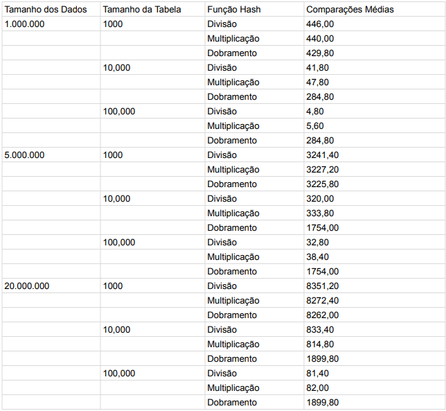
_Tabela de Desempenho de Buscas_

##

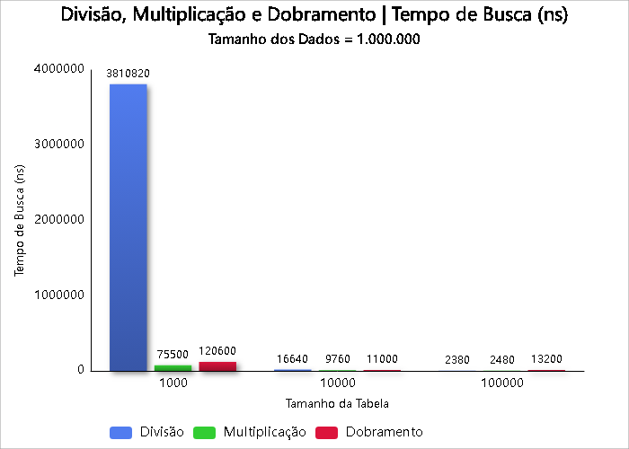
_Gráfico do Tempo de Busca em nanosegundos para Divisão, Multiplicação e Dobramento com Tamanho dos Dados de 1.000.000._

##

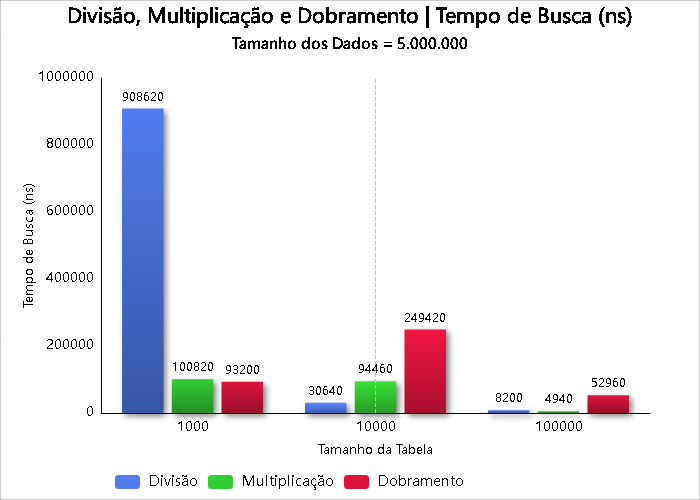
_Gráfico do Tempo de Busca em nanosegundos para Divisão, Multiplicação e Dobramento com Tamanho dos Dados de 5.000.000._

##

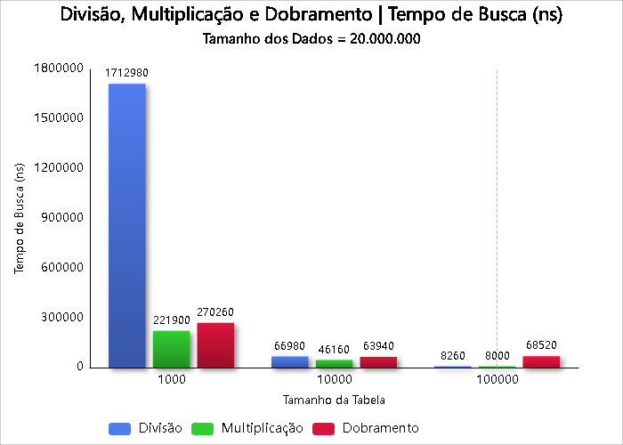
_Gráfico do Tempo de Busca em nanosegundos para Divisão, Multiplicação e Dobramento com Tamanho dos Dados de 20.000.000._

##

Os gráficos de tempo de busca comparam o desempenho das funções de hash Divisão, Multiplicação e Dobramento ao recuperar elementos de tabelas com 1.000.000, 5.000.000 e 20.000.000 de dados, em três diferentes tamanhos de tabela (1000, 10000 e 100000).

Principais observações:

- Em geral, quanto maior o número de colisões, maior é o tempo de busca, pois mais comparações são necessárias.
- A função de Multiplicação apresentou os menores tempos de busca na maioria dos cenários, refletindo sua boa distribuição de dados.
- A função de Divisão teve tempos de busca mais elevados em tabelas pequenas, mas melhora com tabelas maiores.
- A função de Dobramento teve desempenho intermediário, embora em alguns casos específicos tenha ultrapassado a Divisão.
- O aumento no tamanho da tabela melhora os tempos de busca para todas as funções, pois reduz a densidade de colisões.

Esses dados mostram que a eficiência da busca está diretamente ligada à função de hash usada e ao tamanho adequado da tabela.

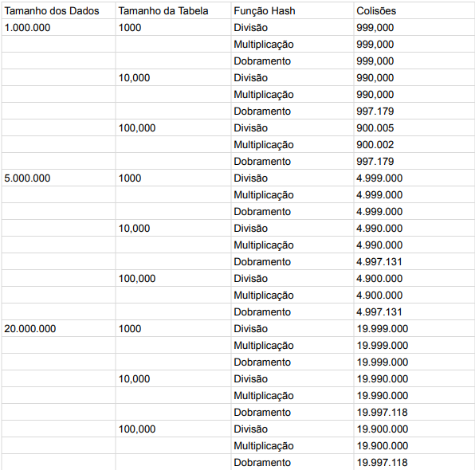
_Tabela de Número de Colisões_

##

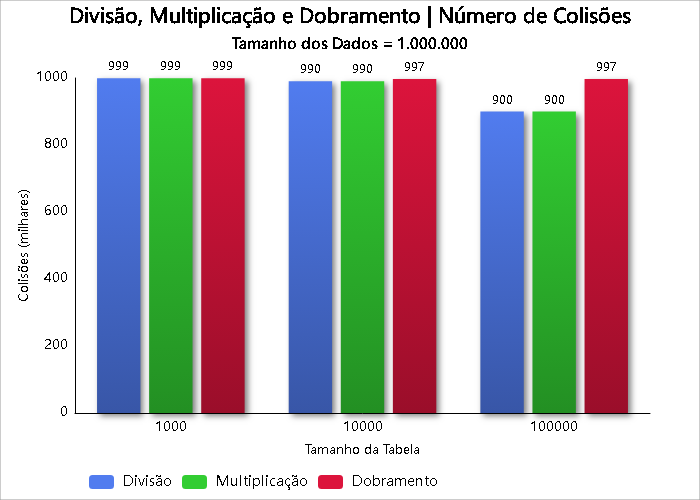
_Gráfico do Número de Colisões para Divisão, Multiplicação e Dobramento com Tamanho dos Dados de 1.000.000._

##

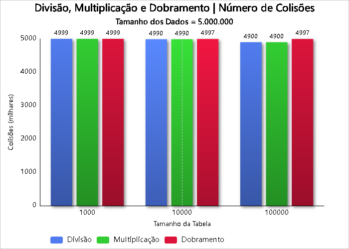
_Gráfico do Número de Colisões para Divisão, Multiplicação e Dobramento com Tamanho dos Dados de 5.000.000._

##

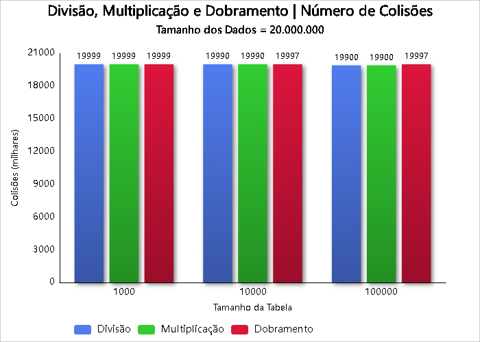
_Gráfico do Número de Colisões para Divisão, Multiplicação e Dobramento com Tamanho dos Dados de 20.000.000._

##

Os gráficos de colisões comparam o número total de colisões ocorridas durante a inserção de 1.000.000, 5.000.000 e 20.000.000 de dados, utilizando as funções de hash: Divisão, Multiplicação e Dobramento, em diferentes tamanhos de tabela (1000, 10000 e 100000).

Principais observações:

- A função de Divisão apresenta o maior número de colisões, especialmente em tabelas menores, o que afeta negativamente o desempenho.
- A função de Multiplicação tem uma quantidade de colisões significativamente menor, mostrando-se mais eficiente na distribuição dos dados.
- A função de Dobramento fica geralmente entre as duas anteriores, mas em alguns casos apresenta valores próximos à Divisão.
- À medida que o tamanho da tabela aumenta, o número de colisões diminui consideravelmente em todas as funções, devido à maior capacidade de dispersão dos dados.

Esses resultados demonstram como a escolha da função de hash e do tamanho da tabela influencia diretamente a ocorrência de colisões e, consequentemente, o desempenho da estrutura.

## 4. Conclusão

Após analisar os resultados, é evidente que a análise dos resultados demonstrou que a eficiência da busca é determinada por uma troca direta entre o tamanho da tabela (uso de memória) e a qualidade da função hash, sendo o baixo fator de carga o pré-requisito mais importante para um bom desempenho.

Comparando as funções, Resto da Divisão e Multiplicação provaram ser escolhas eficientes e equilibradas. Ambas apresentaram tempos de inserção baixos e uma ótima capacidade de distribuir chaves, o que resultou em buscas rápidas e tabelas dimensionadas de maneira adequada. Já a função de Dobramento se provou ser uma opção inadequada pois é computacionalmente mais lenta, devido ao uso de operações com strings, e falha em espalhar os dados em tabelas maiores.

Portanto, com base nos dados gerados, é evidente que para obter alto desempenho, deve-se utilizar uma função de hash rápida e com boa distribuição, como a da Divisão ou Multiplicação, e garantir que o tamanho da tabela seja grande o suficiente para manter o fator de carga baixo. Nosso estudo comprova que uma escolha inadequada da função de hash pode anular os benefícios de uma tabela grande e comprometer a eficiência de toda a aplicação.
